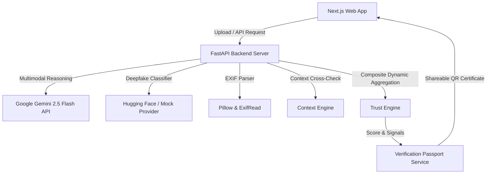

# TRUSTLENS

> *"Before you trust it, verify it."*

**TrustLens** is an AI-powered digital media trust and verification platform built for the **Brainwave 2026 Hackathon**.

Instead of producing a simple binary "fake vs real" black-box answer, TrustLens synthesizes multiple signals to provide an explainable **Trust Score** and actionable recommendation to help users evaluate digital media before sharing it.

---

## 🎯 Key Features

- **Multi-Vector Signal Inspection**:
  1. **AI Generation Detection**: Identifies diffusion model spectral artifacts and generative textures.
  2. **Visual Forensics**: Detects lighting vector divergence, shadow mismatches, and skin smoothing.
  3. **EXIF & Structure Metadata**: Extracts camera signatures, software edit history, and location presence (with GPS privacy redactions).
  4. **Context & Source Verification**: Cross-references claims and extracted text against news indexes.
- **Explainable Trust Score**: 0–100 radial score gauge categorized into:
  - **0 – 30**: `HIGH RISK` (Don't share until independently verified)
  - **31 – 60**: `VERIFY` (Consider verifying source before sharing)
  - **61 – 100**: `LOWER RISK` (No significant manipulation indicators detected)
- **Interactive Evidence Flow Graph**: Node-based visualization allowing users to inspect individual signal confidence metrics.
- **Verification Passport & Dynamic QR Code**: Generates shareable authentication certificates (`TL-XXXXXX`) with QR codes linking to public verification pages.
- **Instant Hackathon Demo Mode**: 1-Click test scenarios running without requiring external API keys.

---

## 🏗️ Architecture Overview



---

## 🛠️ Tech Stack

### Frontend
- **Framework**: Next.js 16 (App Router, Turbopack), React 19, TypeScript
- **Styling**: Tailwind CSS with custom dark cybersecurity glassmorphism design system
- **Icons & Animations**: Lucide React, Framer Motion
- **Utilities**: `qrcode`, `clsx`, `tailwind-merge`

### Backend
- **Framework**: Python 3.10+, FastAPI, Pydantic v2, Uvicorn
- **AI & Forensics**: Google Gemini API (`google-genai`), Hugging Face Inference API, Pillow (`PIL.ExifTags`), ExifRead
- **QR Generator**: `qrcode`

---

## 🚀 Running Locally

Requires **Python 3.9+** and **Node.js 18+**. The app runs fully in demo mode with no API keys.

### 1. Backend (port 8000)

```bash
cd backend
python3 -m venv .venv
source .venv/bin/activate        # Windows: .venv\Scripts\activate
pip install -r requirements.txt
uvicorn app.main:app --reload --port 8000
```

Interactive API docs: <http://localhost:8000/docs>

> Run `uvicorn` from the `backend/` directory. Configuration is read from `backend/.env`
> (see `backend/.env.example`); without it the app defaults to the mock providers.

### 2. Frontend (port 3000)

```bash
cd frontend
npm install
npm run dev
```

Open <http://localhost:3000>. The frontend defaults to `http://localhost:8000/api/v1`;
override it with `NEXT_PUBLIC_API_URL` in `frontend/.env.local` if your backend runs elsewhere.

### 3. Try it

- **Demo scenarios** (no upload needed): `/demo`, or hit `GET /api/v1/demo/{authentic|deepfake|context}`
- **Upload your own media**: `/verify`

> **CORS**: the backend allows `http://localhost:3000` by default. If you serve the
> frontend from another origin, set `CORS_ORIGINS` in `backend/.env`.

---

## ⚖️ Responsible AI Notice & Limitations

TrustLens operates as a **probabilistic decision-support tool**. No automated system can guarantee that digital media is 100% authentic or 100% fake. Missing EXIF metadata is common on social platforms and is not definitive proof of manipulation. Users should always exercise critical thinking.
