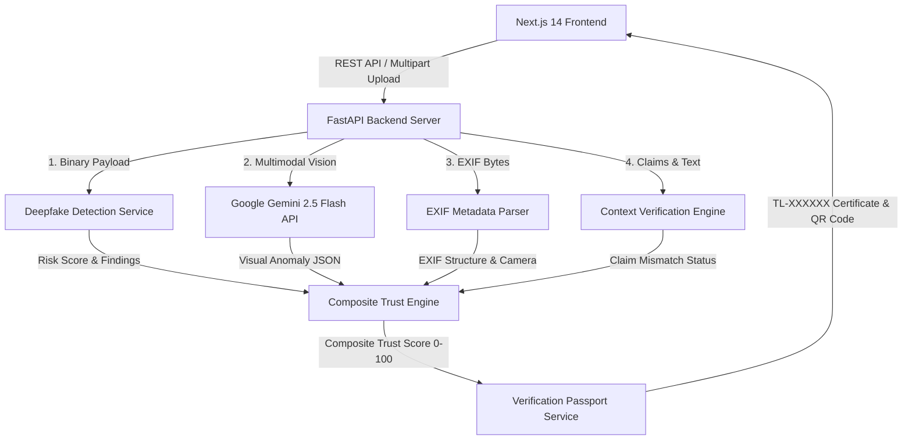

# TrustLens System Architecture

"Before you trust it, verify it."

TrustLens is built using a clean monorepo architecture separating the Next.js presentation layer from the Python FastAPI analytical backend.

## Key Components

1. **Frontend Presentation Layer (`frontend/`)**:
   - Built with Next.js App Router, React, TypeScript, Tailwind CSS, and Framer Motion.
   - Operates dark cybersecurity UI design system.
   - Provides drag-and-drop file upload, animated stage progress, radial Trust Score gauge, interactive evidence flow graph, and QR code certificate generator.

2. **FastAPI Backend Server (`backend/`)**:
   - Built with FastAPI, Pydantic v2, Pillow, ExifRead, and Google GenAI SDK.
   - Implements provider design pattern for external AI models (`BaseDeepfakeProvider`, `MockDeepfakeProvider`, `HuggingFaceDeepfakeProvider`).
   - Feature flags controlled via `.env` configuration.
